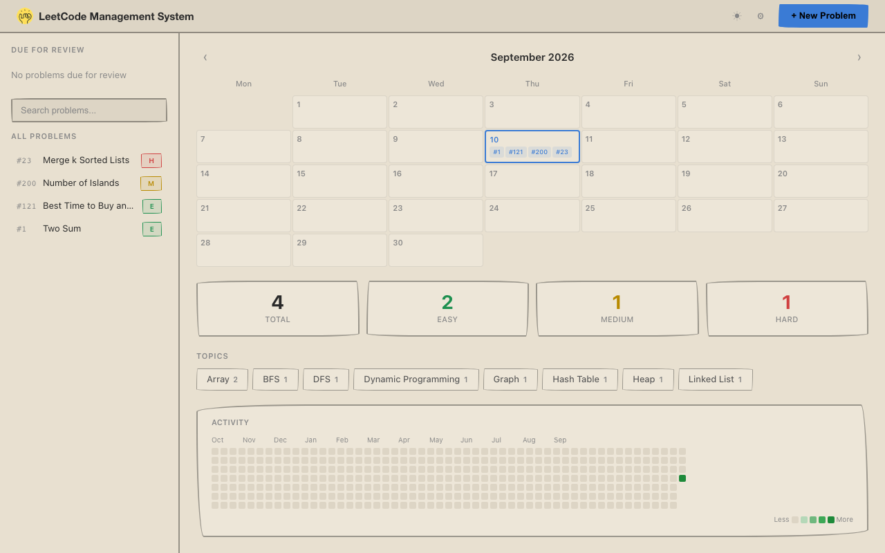

<p align="center">
  
</p>

# LeetCode Management System



A portable, local-first notebook for tracking and reviewing LeetCode problems. Stores everything in a single SQLite database. Put it in a cloud drive folder and access your data from any machine.

## What it does

- **Calendar view** with problem badges and a GitHub-style contribution graph
- **Spaced repetition**: mark problems as revised with configurable reminder intervals
- **Problem editor**: split-pane view with problem description on the left, jupyter-style code + commentary blocks on the right (Monaco editor, markdown with KaTeX math and Mermaid diagrams)
- **Tagging and filtering**: multi-tag AND filtering, difficulty tracking (Easy/Medium/Hard), optional Elo ratings
- **LeetCode fetch**: pull problem details directly by number
- **LeetCode sync**: connect a public username (no login) to import your recent accepted submissions, log re-solves as revisions, and overlay your submission calendar onto the activity graph
- **Dark/light mode**: toggle from any page

## Setup

Double-click `LMS.command` (macOS) or `launch.bat` (Windows) in Finder/Explorer. That's it.

The launcher creates a virtual environment, installs dependencies (`flask`, `requests`), starts the server on port 5001, and opens your browser. Linux users: `./launch.sh`.

## Data

All data lives in `./data/` by default, configurable from Settings inside the app. This directory is gitignored. Your problems, solutions, and revision history stay on your machine.

## Testing

```bash
pip install pytest
pytest tests/ -v
```

## License

MIT
